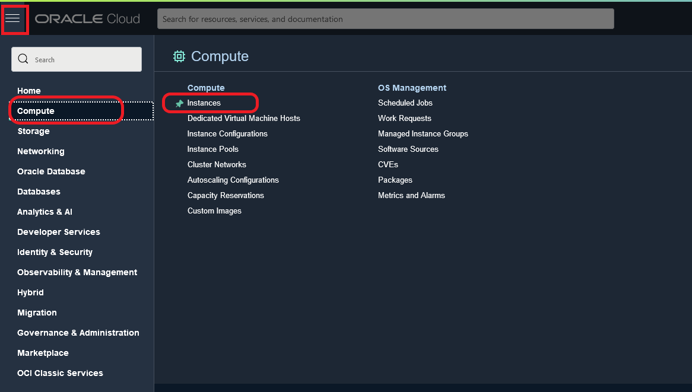
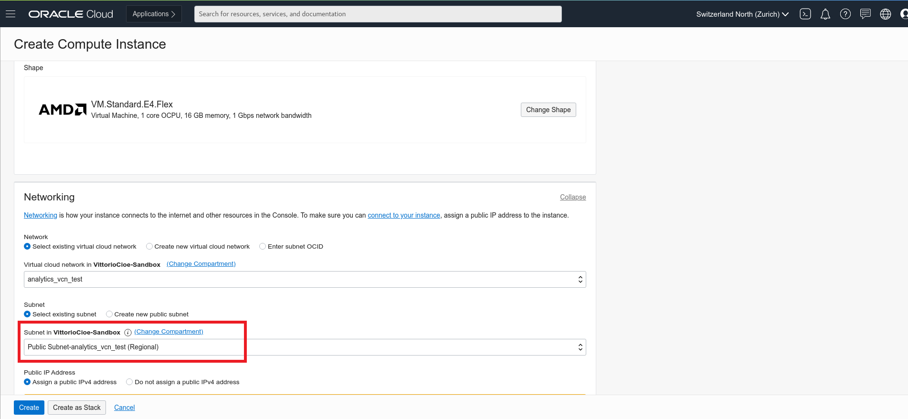
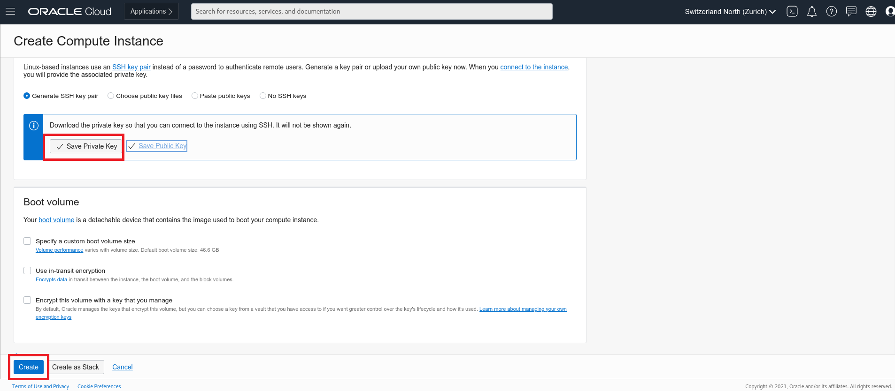

# Lab 2 - Create compute instance bastion host

## Introduction

A bastion host is a compute instance that serves as the public entry point for accessing a private network from external networks like the internet. Traffic must flow through the bastion host to access the private network, and you can set up security mechanisms on the bastion to handle that traffic.

See the white paper Bastion Hosts: **[Protected Access for Virtual Cloud Networks](https://www.oracle.com/a/ocom/docs/bastion-hosts.pdf)**. 

## Key Objectives:

- Learn how to create Compute instance on Oracle Cloud 

## Steps

### **Step 2.1:**
- From the main menu on the top left corner select _**Compute >> Instances**_
  

### **Step 2.2:** 
- Check at the compartment selector on the buttom left corner and verify that you are using the same compartment used to create the VCN. To create the compute instance click on the _**Create Instance**_ blue button

### **Step 2.3:** 
- In the _**Name**_ field, insert _**mysql-analytics-test-bridge**_ (or any other name at your convenience). This name will be used also as internal FQDN. 
The _**Placement and Hardware section**_ is the section where you can change Availability Domain, Fault Domain, Image to be used, and Shape of resources. For the scope of this workshop leave everything as default.

### **Step 2.4:** 
- In the Networking section, check that your previously created VCN is selected and in the Subnet section, select your PUBLIC subnet (_**Public Subnet - analytics_vcn_test**_) from the dropdown menu.
  

### **Step 2.5:** 
- Scroll down and MAKE SURE TO DOWNLOAD the proposed private key. 
You will use it to connect to the compute instance later on.
Once done, click _**Create**_

### **Step 2.6:** 
- Once the compute instance will be up and running, you will see the square icon on the left turning green.
 However, you can proceed to the next lab until the provisioning is done.
  

## Conclusion

In this lab we created a compute instance with bastion host that serves as the public entry point, and select the VCN that we have created in the privous lab, and saved the private key on our local device that will be used later in this workshop
Now let's go ahead and create MySQL DB System (MDS) for Heatwave **[in the next lab!](Lab3.md)**

Learn more about **[Compute Service on Oracle Cloud](https://docs.oracle.com/en-us/iaas/Content/Compute/Concepts/computeoverview.htm)** 
