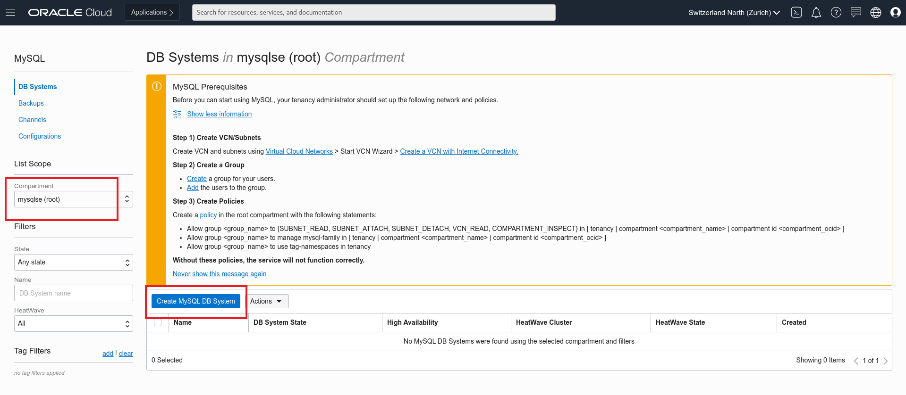
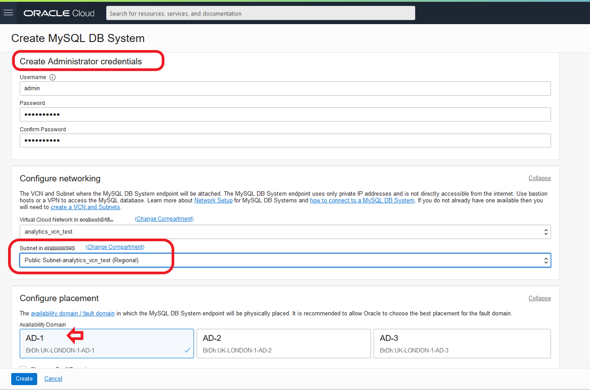
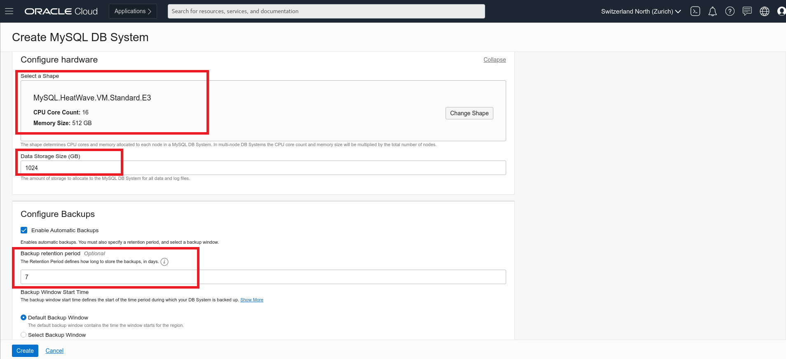
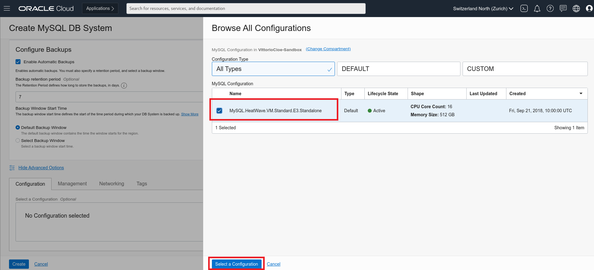

# Lab 3: Create MySQL DB System (MDS) with Heatwave 

## Key Objectives:
- Learn how to deploy and configure MySQL Database Service with Heatwave.
- Learn how to create the Administrator user for the MDS

## Introduction

By enabling HeatWave you will deploy a standalone DB System characterized by a HeatWave-compatible shape (MySQL.HeatWave.VM.Standard.E3) and 1TB of data storage. The DB System and HeatWave cluster must use the same shape. For more information, see **[HeatWave](https://docs.oracle.com/en-us/iaas/mysql-database/doc/heatwave1.html#GUID-9401C69A-B379-48EB-B96C-56462C23E4FD)**. 


## Steps

### **Step 3.1:**
- From the main menu on the left select _**Databases >> DB Systems**_
  


### **Step 3.2:**
- The previous step will bring you to the DB System creation page. 
Look at the compartment selector on the left and check that you are using the same compartment used to create the VCN and the Compute Instance. Once done, click on _**Create MySQL DB System**_.



### **Step 3.3:**
- Start creating the DB System. Cross check again the compartment and assign to the DB System the name _**mysql-analytics-test**_ and select the HeatWave box. This will allow to create a MySQL DB System which will be HeatWave-ready. Ignore other boxes.
  


### **Step 3.4:**
- In the _**Create Administrator Credential**_ section enter the following:
```
username: admin
password: Oracle.123
```
- In the _**Configure Networking**_ section make sure you select the same subnet which you have used to create the Compute Instance (Public-Subnet-analytics_vcn_test).

- Leave the default availability domain and proceed to the _**Configure Hardware**_ section.
 
  

### **Step 3.5:**
- Confirm that in the _**Configure Hardware**_ section, the selected shape is MySQL.HeatWave.VM.Standard.E3, CPU Core Count: 16, Memory Size: 512 GB, Data Storage Size: 1024.
In the _**Configure Backup**_ section leave the default backup window of 7 days.



### **Step 3.6:**
- Scroll down and click on _**Show Advanced Options**_ 
  


### **Step 3.7:**
- In the Configuration tab click on _**Select Configuration**_ 


### **Step 3.8:**
- In the _**Browse All Configurations**_ window, select MySQL.HeatWave.VM.Standard.E3.Standalone, and click the button _**Select a Configuration**_ 



### **Step 3.9:**
- If everything is correct you should see something corresponding to the below


### **Step 3.10:**
- Go to the Networking tab, and in the Hostname field enter _**mysql-analytics-test**_ (same as DB System Name). 
Check that port configuration corresponds to the following:
MySQL Port: 3306
MySQL X Protocol Port: 33060
Once done, click the _**Create**_ button.


### **Step 3.11:**
- The MySQL DB System will enter _**CREATING**_ state (as per picture below). Meanwhile you can go ahead and proceed to the next Lab.
  


## Conclusion

In this Lab you deployed MySQL Database Service with HeatWave engine and created the administration user for the database. All set? now we are ready to connect to the bastion host, and install MySQL Shell in the next lab!
 
Learn more about **[DB Systems on Oracle Cloud](https://docs.oracle.com/en-us/iaas/Content/Database/Concepts/overview.htm)**

**[<< Go to Lab 2](/Lab2/README.md)** | **[Home](../README.md)** | **[Go to Lab 4 >>](/Lab4/README.md)**