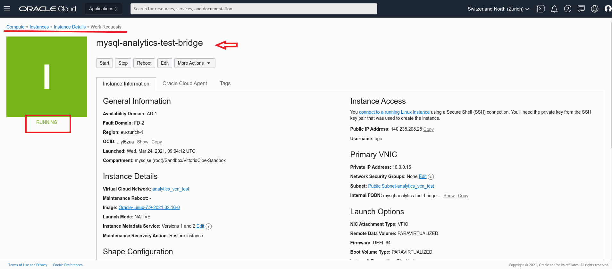
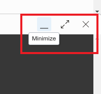

# Lab 4 - Connect to bastion host, install MySQL Shell and download workshop data

_**4.1-**_ In the main menu on the left go to Compute >> Instances.
Click on the instance you have previously created and take note of the Public IP Address.


_**4.2-**_ In order to connect to the bastion host, we will use the cloud shell, a small linux terminal embedded in the OCI interface.
To access cloud shell, click on the shell icon next to the name of the OCI region, on the top right corner of the page


_**4.3-**_ Once the cloud shell is opened, you will see the command line as per picture below:


_**4.4-**_ We suggest to increase the font size, as per picture below:


_**4.5-**_ On the top left corner of the cloud shell there are Minimize, Maximize and Close buttons 
If you Maximize the cloud shell it will take the size of the entire page. Remember to Restore the size or Minimize prior of changing page in the OCI interface.


_**4.6-**_ Drag and drop the previously saved private key into the cloud shell. Get the file name with the command_**ll**_


_**4.7-**_ In order to establish an ssh connection with the bastion host using the Public IP, execute the following commands:
```
chmod 600 <private-key-file-name>.key
ssh -i <private-key-file-name>.key opc@<compute_instance_public_ip>
```

If prompted to accept the finger print, enter_**yes**_ and hit enter.

_**4.8-**_ From the established ssh connection, install MySQL Shell and MySQL client executing the following commands:
```
wget https://dev.mysql.com/get/mysql80-community-release-el7-3.noarch.rpm
sudo yum localinstall mysql80-community-release-el7-3.noarch.rpm
sudo yum install mysql-shell ```(when prompted a warning about the public key enter_**y**_)```
sudo yum install mysql-community-client
```

_**4.9-**_ Launch MySQL Shell executing the following command:
```
mysqlsh
When you see the MySQL Shell colorful prompt, exit with the following command:
\q
```

_**4.10-**_ Download and unzip the workshop material using the following commands:
```
cd /home/opc
wget https://objectstorage.eu-frankfurt-1.oraclecloud.com/p/wTJ02aU-A5C2RCfBn3ymwm9jaAI01uR23_je6ZnFXMZ3-z3KqZOxpMOMX1zDZvxn/n/odca/b/mysql_data/o/heatwave_workshop.zip
unzip heatwave_workshop.zip
```

_**4.11-**_ Verify the extracted material executing_**ll**_ command.
Among the output, you should see the following file names:
```
tpch_dump
tpch_offload.sql
tpch_queries_mysql.sql
tpch_queries_rapid.sql
```

**[Go to the next Lab](Lab5.md)**
