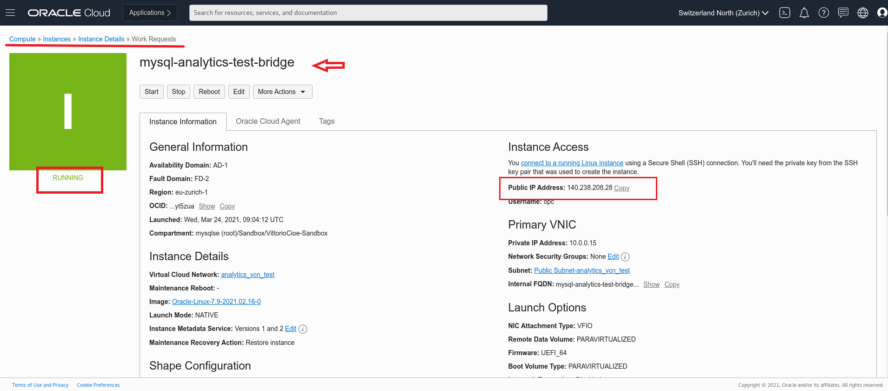

# Lab 4: Connect to the bastion host, install MySQL Shell and download the workshop dataset

## Key Objectives:
- Learn how to connect to the cloud shell and to the bastion host 
- Learn how to launch MySQL shell
- Download and setup workshop material
  
## Introduction

The Cloud Shell machine is a small virtual machine running a Bash shell which you access through the OCI Console. Cloud Shell comes with a pre-authenticated OCI CLI, set to the Console tenancy home page region, as well as up-to-date tools and utilities.Cloud Shell comes with 5GB of persistent storage for the home directory, so you can make local changes to your home directory, and then continue working on your project when you come back to Cloud Shell.Cloud Shell is free to use (within your tenancy's monthly limits) and doesn’t require any setup or prerequisites other than an IAM policy granting access to Cloud Shell. When you start Cloud Shell, the service configures your Cloud Shell session with the currently selected region in the Console so that the OCI CLI is interacting with the selected Console region.


## Steps

### **Step 4.1:**
- From the main menu on the left go to _**Compute >> Instances**_
 Click on the instance you have previously created and take note of the _**Public IP Address**_.



### **Step 4.2:**
- In order to connect to the bastion host, we will use the cloud shell, a small linux terminal embedded in the OCI interface.
To access cloud shell, click on the shell icon next to the name of the OCI region, on the top right corner of the page


### **Step 4.3:**
- Once the cloud shell is opened, you will see the command line as per picture below:
  


### **Step 4.4**
- We suggest to increase the font size, as per picture below:
  


### **Step 4.5:**
- On the top left corner of the cloud shell there are Minimize, Maximize and Close buttons. If you Maximize the cloud shell it will take the size of the entire page. Remember to Restore the size or Minimize prior of changing page in the OCI interface.


### **Step 4.6:**
- Drag and drop the previously saved private key into the cloud shell. Get the file name with the command _**ll**_ 
  


### **Step 4.7:**
- In order to establish an ssh connection with the bastion host using the Public IP, execute the following commands:
```
chmod 600 <private-key-file-name>.key
ssh -i <private-key-file-name>.key opc@<compute_instance_public_ip>
```

If prompted to accept the finger print, enter _**yes**_ and hit enter, then you will get a Warning

_**Warning: Permanently added '130.******' (ECDSA) to the list of known hosts.**_

Now that you connected to the instance you can proceed to the next step.

### **Step 4.8:**
- From the established ssh connection, install MySQL Shell and MySQL client executing the following commands and the expected outputput should be as following:
  
```
wget https://dev.mysql.com/get/mysql80-community-release-el7-3.noarch.rpm

```

```
sudo yum localinstall mysql80-community-release-el7-3.noarch.rpm
```


_**when prompted a warning about the public key enter "y"**_

```
sudo yum install mysql-shell  
```


```
sudo yum install mysql-community-client
```


### **Step 4.9:**
- Launch MySQL Shell executing the following command:
```
mysqlsh
```
When you see the MySQL Shell colorful prompt, exit with the following command:
```
\q
```

### **Step 4.10:**
- Download and unzip the workshop material using the following commands:
```
cd /home/opc
```
```
wget https://objectstorage.eu-frankfurt-1.oraclecloud.com/p/wTJ02aU-A5C2RCfBn3ymwm9jaAI01uR23_je6ZnFXMZ3-z3KqZOxpMOMX1zDZvxn/n/odca/b/mysql_data/o/heatwave_workshop.zip
```


```
unzip heatwave_workshop.zip
```


After it is done extracting the files you can move to the next step and test it

### **Step 4.11:**
- Verify the extracted material executing _**ll**_ command.
Among the output, you should see the following file names:
```
tpch_dump
tpch_offload.sql
tpch_queries_mysql.sql
tpch_queries_rapid.sql
```


## Conclusion

In this Lab we launched the cloud shell; imported the private keys to connect to the compute instance; we installed MySQL Shell and MySQL client; finally we downloaded and unzipped the dataset that will be used later on for benchmark analysis.

**[<< Go to Lab 3](/Lab3/README.md)** | **[Home](../README.md)** | **[Go to Lab 5 >>](/Lab5/README.md)**
