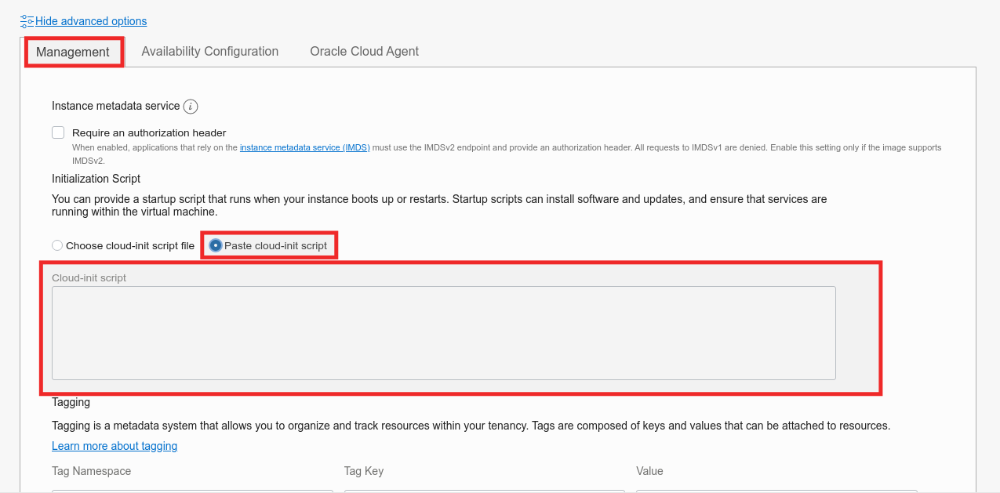

# Lab 4a: Oracle Analytics Cloud用のMySQL Routerインスタンスを作成し、MDS/HeatWaveに接続する

## 実施すること
- 特定のコンパートメントにコンピュート・インスタンスを作成する
- SSH経由でCloud Shellを利用してコンピュート・インスタンスに接続する
- Modify the MySQL Routerの接続先をMDS/HeatWaveに変更し接続する

## 概要
このでは、MySQLルーターをホストするコンピュート・インスタンスをデプロイします。MDS/HeatWaveはプライベートIPアドレスのみを公開しているため、インターネットを介してネイティブに通信することはできません。インターネットとの通信は、次の2つの方法で実現できます。

- OCIテナンシーとオンプレミス・データセンタ間のIPSecVPN接続のセットアップ：IPSecの概要**[サイト間VPN](https://docs.oracle.com/ja-jp/iaas/Content/Network/Tasks/managingIPsec.htm)**
- パブリックインターネットにアクセスできるコンピュート・インスタンス上のMySQL Routerを使用して、リバースプロキシとして機能し、OCI内部ネットワークを介して受信したトラフィックをオンプレミスのMySQLインスタンスにルーティングします。 MySQL Routerは、元々、オンプレミスの高可用性セットアップに透過的なルーティングレイヤーを提供することを目的としていますが、構成によってはひとつのインスタンスへの単純なルーティングも提供できます。 **[MySQL Routerの概要](https://www.mysql.com/jp/products/enterprise/router.html)**

IPSec接続は、オンプレミス環境をOCIに接続するために使用する **最も安全な** アプローチです。このハンズオンでは、MySQL Routerを使用してインターネット経由でデータベーストラフィックを実行します。

以下の手順では、cloud-initスクリプトを使用して、MySQLルーターを自動的にデプロイ・設定します。デプロイ後、ルーター設定でMDS/HeatWaveインスタンスのIPアドレスを設定します。

## 手順

### **Step 4.1:**
- 画面左上のメニューから _**コンピュート >> インスタンス**_ を選択します。


### **Step 4.2:**
- 正しいコンパートメントが選択されていることを確認します。

- _**インスタンスの作成**_ をクリックします。


### **Step 4.3:**
- _**名前**_ に、_**mysql-replication-router**_ (or any other name at your convenience)を入力します。

- _**配置**_ セクションではアベリラビリティ・ドメインもしくはフォルト・ドメインを変更できます。このハンズオンでは、デフォルトの設定を利用します。


### **Step 4.4:**
- _**イメージとシェイプ**_ セクションでは、OSイメージと割り当てるシェイプを設定することができます。
- このセクションが縮小されている場合は、_**編集**_ をクリックして表示します。
- 割り当てるシェイプは _**イメージの変更**_ をクリックして変更することができます。


### **Step 4.5:**
- _**すべてのイメージの参照**_ 画面で_**Oracle Linux**_ を選択し、 _**OSバージョン**_ のドロップダウンから _**8**_ を選択します。


### **Step 4.6:**
- _**イメージの選択**_ をクリックします。


### **Step 4.7:**
- _**Change Shape**_ をクリックします。


### **Step 4.8:**
- _**すべてのシェイプの参照**_ 画面で_**AMD**_ をクリックします。 Then, under _**VM.Standard.E4.Flex**_, _**OCPUの数**_ に _**2**_ を入力すると
 _**メモリー量 (GB)**_ が自動的に _**32**_　になります。その後_**シェイプの選択**_ をクリックします。


### **Step 4.9:**
- _**ネットワーキング**_ セクションに移ります。
- このセクションが縮小されている場合は、_**編集**_ をクリックして表示します。
- VCNとして _**analytics_vcn_test**_ が選択されていることを確認し、サブネットとして _**パブリック・サブネット-analytics_vcn_test (Regional)**_ が選択されていることを確認します。
- _**パブリックIPv4アドレスの割当て**_ ラジオボタンが選択されていることを確認します。


### **Step 4.10:**
- In the _**SSHキーの追加**_ セクションでは、_**キー・ペアを自動で生成**_ を選択し、_**秘密キーの保存**_ をクリックします。


- ローカルマシンに秘密キーを保存したら、ダウンロードしたパスとファイル名を控えておきます。

_**PLEASE NOTE:**_ OCIが生成する秘密キーは、名前に作成日を使用します（例：ssh-key-YYYY-MM-DD.key）。 同じ日に2つ以上の秘密キーを生成すると、オペレーティングシステムが保存時にファイル名を変更する場合があります。 たとえば、保存している現在の秘密キーは、次のような命名規則に従う場合があります。
ssh-key-YYYY-MM-DD（1）.key
正しいファイルか注意してください。

### **Step 4.11:**
- 画面下部の _**ブート・ボリューム**_ セクションの下に表示されている _**拡張オプションの表示**_　をクリックします。


### **Step 4.12:**
- In the _**管理**_ タブで _**Cloud-initスクリプトの貼付け**_ ラジオボタンを選択すると、下記画面例のように _**Cloud-initスクリプト**_ テキストボックスが表示されます。



### **Step 4.13:**
- テキストボックスに以下のスクリプトをペーストします。

```
#cloud-config
# Source: https://cloudinit.readthedocs.io/en/latest/topics/examples.html#yaml-examples
# check the yaml syntax with https://yaml-online-parser.appspot.com/

output: {all: '| tee -a /var/log/cloud-init-output.log'}

# Run these commands only at first boot
runcmd:
- 'echo "c2VkIC1pIHMvU0VMSU5VWD1lbmZvcmNpbmcvU0VMSU5VWD1wZXJtaXNzaXZlL2cgL2V0Yy9zeXNjb25maWcvc2VsaW51eApzZWQgLWkgcy9TRUxJTlVYPWVuZm9yY2luZy9TRUxJTlVYPXBlcm1pc3NpdmUvZyAvZXRjL3NlbGludXgvY29uZmlnCnN5c3RlbWN0bCBzdG9wIGZpcmV3YWxsZApzeXN0ZW1jdGwgZGlzYWJsZSBmaXJld2FsbGQKd2dldCBodHRwczovL2Rldi5teXNxbC5jb20vZ2V0L215c3FsODAtY29tbXVuaXR5LXJlbGVhc2UtZWw4LTEubm9hcmNoLnJwbQp3Z2V0IGh0dHBzOi8vZG93bmxvYWRzLm15c3FsLmNvbS9hcmNoaXZlcy9nZXQvcC80MS9maWxlL215c3FsLXJvdXRlci1jb21tdW5pdHktOC4wLjIyLTEuZWw4Lng4Nl82NC5ycG0KeXVtIGxvY2FsaW5zdGFsbCAteSAtLW5vZ3BnY2hlY2sgbXlzcWw4MC1jb21tdW5pdHktcmVsZWFzZS1lbDgtMS5ub2FyY2gucnBtCnl1bSBtb2R1bGUgLXkgLS1ub2dwZ2NoZWNrIGRpc2FibGUgbXlzcWwKeXVtIGluc3RhbGwgLXkgLS1ub2dwZ2NoZWNrIG15c3FsLXNoZWxsCnl1bSBsb2NhbGluc3RhbGwgLXkgLS1ub2dwZ2NoZWNrIG15c3FsLXJvdXRlci1jb21tdW5pdHktOC4wLjIyLTEuZWw4Lng4Nl82NC5ycG0KZWNobyAiIiA+PiAvZXRjL215c3Fscm91dGVyL215c3Fscm91dGVyLmNvbmYKZWNobyAiW3JvdXRpbmc6cHJpbWFyeV0iID4+IC9ldGMvbXlzcWxyb3V0ZXIvbXlzcWxyb3V0ZXIuY29uZgplY2hvICJiaW5kX2FkZHJlc3MgPSAwLjAuMC4wIiA+PiAvZXRjL215c3Fscm91dGVyL215c3Fscm91dGVyLmNvbmYKZWNobyAiYmluZF9wb3J0ID0gMzMwNiIgPj4gL2V0Yy9teXNxbHJvdXRlci9teXNxbHJvdXRlci5jb25mCmVjaG8gImRlc3RpbmF0aW9ucyA9IFNPVVJDRV9QVUJMSUNfSVA6MzMwNiIgPj4gL2V0Yy9teXNxbHJvdXRlci9teXNxbHJvdXRlci5jb25mCmVjaG8gInJvdXRpbmdfc3RyYXRlZ3kgPSBmaXJzdC1hdmFpbGFibGUiID4+IC9ldGMvbXlzcWxyb3V0ZXIvbXlzcWxyb3V0ZXIuY29uZgo=" | base64 -d >> setup.sh'
- 'chmod +x setup.sh'
- './setup.sh'

final_message: "The system is finally up, after $UPTIME seconds"
```

このスクリプトは、MySQLシェルとMySQLルーターをインストールし、MDS/HeatWaveインスタンスを利用する最小限の設定を行います。
_**スクリプトを正しくコピーして貼り付けてください。**_

- ここまでできたら _**作成**_ をクリックします。


_**補足 (今回のハンズオンでは不要です)**_ :
使用しているCloud-initスクリプトは、base64でエンコードされた文字列からスクリプトを生成して実行します。 これは、Cloud-initが特殊文字を処理するときに発生する可能性のある問題を回避するために行なっています。 参考までに、スクリプトの内容を以下に示します。
```
sed -i s/SELINUX=enforcing/SELINUX=permissive/g /etc/sysconfig/selinux
sed -i s/SELINUX=enforcing/SELINUX=permissive/g /etc/selinux/config
systemctl stop firewalld
systemctl disable firewalld
wget https://dev.mysql.com/get/mysql80-community-release-el8-1.noarch.rpm
wget https://downloads.mysql.com/archives/get/p/41/file/mysql-router-community-8.0.22-1.el8.x86_64.rpm
yum localinstall -y --nogpgcheck mysql80-community-release-el8-1.noarch.rpm
yum module -y --nogpgcheck disable mysql
yum install -y --nogpgcheck mysql-shell
yum localinstall -y --nogpgcheck mysql-router-community-8.0.22-1.el8.x86_64.rpm
echo "" >> /etc/mysqlrouter/mysqlrouter.conf
echo "[routing:primary]" >> /etc/mysqlrouter/mysqlrouter.conf
echo "bind_address = 0.0.0.0" >> /etc/mysqlrouter/mysqlrouter.conf
echo "bind_port = 3306" >> /etc/mysqlrouter/mysqlrouter.conf
echo "destinations = SOURCE_PUBLIC_IP:3306" >> /etc/mysqlrouter/mysqlrouter.conf
echo "routing_strategy = first-available" >> /etc/mysqlrouter/mysqlrouter.conf
```
**注意事項:** ハンズオンをスムーズに進めていただくため、firewalldとselinuxを無効にする方法を紹介します。 深刻なセキュリティ問題につながる可能性があるため、この構成を稼働環境に適用することはお控えください。

### **Step 4.14:**
- インスタンスは _**作成中**_ の状態になります。


### **Step 4.15:**
- インスタンスが起動したら _**実行中**_ の状態になります。 この状態になるまで数分間かかります。
インスタンスの状態が _**実行中**_ になったら、 後で _**mysqlrouter**_ の設定、SSH接続に必要な _**パブリックIPアドレス**_ と _**内部FQDN**_ を控えておきます。


### **Step 4.16:**
- 次の図に示すように、_**Cloud Shell**_ に戻り、保存した秘密キーファイルをローカルマシンから Cloud Shellにドラッグアンドドロップします。


### **Step 4.17:**
_**注意事項**_: この操作では、MySQL Routerインスタンスへの接続を行います。 この手順を実行する前に、Cloud-initスクリプトが実行を完了し、インスタンスが再起動するまで数分待ちます。

-前述の_ **パブリックIPアドレス** _ を使用してMySQL Routerインスタンスに接続するには、次の手順を実行します。

a -秘密キーファイルの名前を変更し、OCIに必要な権限を割り当てます。
```
mv ssh-*.key router.key
chmod 600 router.key
```
b - @以降を _**パブリックIPアドレス**_ に置き換え、作成した _**MySQL Router**_ インスタンスにSSH経由で接続します。
```
ssh -i router.key opc@<router-instance-public-ip>
```
c - フィンガープリントを受け入れるかどうか確認メッセージが表示された場合は _**yes**_ を入力します。


### **Step 4.18:**

- MySQL Routerがインストールされているインスタンスに接続できたら、_**MDS/HeatWaveプライベートIPアドレス**_ を使用して _**mysql-analytics-test**_ を指すようにMySQLRouterの設定を変更する必要があります。通常は、_**/etc/mysqlrouter/mysqlrouter.conf**_ のMySQL Router設定ファイルを変更する必要があります。

- ハンズオンをスムーズに進めていただくために、このインスタンスにインストールされているMySQL Routerは事前に設定を行っていますが、_**MDS/HeatWaveプライベートIPアドレス**_ （たとえば、 10.0.1.100）を設定する必要があります。設定には次のコマンドを実行します。
```
sudo sed -i 's/destinations =.*/destinations = 10.0.1.100:3306/g' /etc/mysqlrouter/mysqlrouter.conf
```
_**MDS/HeatWaveのプライベートIPアドレスは以下で確認できます**_
 _**メインメニュー >> データベース >> DBシステム>>**_ から _**mysql-analytics-test >>**_ をクリックして _**プライベートIPアドレス**_ を確認します。(下図参照)


_**注意事項**_: _**MDS/HeatWaveプライベートIPアドレス**_ を指定したコマンド例は以下の通りです。
_**sudo sed -i s/SOURCE_PUBLIC_IP/10.0.1.100/g /etc/mysqlrouter/mysqlrouter.conf**_

- 完了したら、下記のコマンドを実行して設定ファイルのパラメタ_**destinations**_ の値が _**MDS/HeatWave**_ のプライベートIPアドレスと等しいことを確認します。
```
cat /etc/mysqlrouter/mysqlrouter.conf
```


### **Step 4.19:**
- MySQL Routerを起動し、MDS/HeatWaveインスタンスへの接続を確認します。
これを行うには、次の手順を実行します。
a - mysqlrouterサービスを有効にしてサービスを開始します。
```
sudo systemctl enable mysqlrouter
sudo systemctl start mysqlrouter
```

b - MySQL Shellを利用して、mysqlrouter経由で _**mysql_analytics_test**_ にルーティング(接続)できるか確認します。
```
mysqlsh --uri root:Oracle.123@127.0.0.1:3306 --sql
select @@version;
show databases;
```

### **Step 4.20:**
- 以下のコマンドを実行し、MySQL Shellを終了します。
```
\exit
```
- MySQL Routerインスタンスへの接続は_**切断しないでください**_。
- Cloud Shellウィンドウを最小化し、次の演習に進みます。


## Conclusion

このラボでは、インターネット接続を備えたコンピューティングインスタンスにMySQL Routerルーターをデプロイして設定し、MDS/HeatWaveインスタンスをポイントしました。
これで、次のLabに進むことができます!

**[MySQL Router](https://www.mysql.com/jp/products/enterprise/router.html)**
**[<< Lab 4](/Lab4/README.md)** | **[Home](../README.md)** | **[Lab 5 >>](/Lab5/README.md)**
