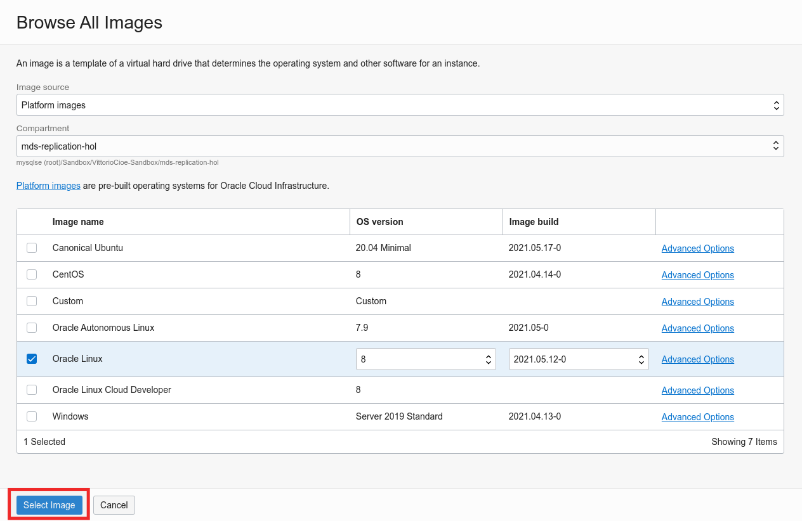

# Lab 4: Create a MySQL Router Instance to connect MySQL Database Service with the Replication Source


## Key Objectives:
- Learn how to create a compute instance in a specific compartment
- Learn how to use Cloud Shell to connect to a compute instance via ssh
- Modify the MySQL Router configuration to point to Replication Source and test the connection

## Introduction
In this lab we will deploy a compute instance which will host MySQL Router.
As you have noticed, MySQL Database Service DB System is exposing a Private IP address only, therefore cannot natively communicate via the public internet.
Communication with the public internet can be achieved in two ways:
- Setting up an IPSec VPN connection between your OCI tenancy and your on premise data center: **[IPSec Overview](https://docs.oracle.com/en-us/iaas/Content/Network/Tasks/managingIPsec.htm)**
- Using a MySQL Router running on a Compute Instance, with access to the Public Internet, to act as a reverse proxy, routing the database traffic, received over the OCI internal network, to the source on-premise MySQL instance. Even if the MySQL Router it is originally intended to provide a transparent routing layer for an on-premise high-availability setup, if configured to do so, can provide also simple routing towards a single instance.
**[MySQL Router Overview](https://www.mysql.com/it/products/enterprise/router.html)**

IPSec connectivity it is **the most secure** approach to be used in order to connect your on-premise environment with OCI. In this hands-on lab, for simplicity, we expose the database traffic via the public internet using MySQL Router.

The steps you will execute will allow you to deploy and configure MySQL Router automatically, using a cloud-init script. After the deployment, you will set the IP Address for the MySQL Source instance in the router configuration.

## Steps

### **Step 4.1:**
- From the main menu on the top left corner select _**Compute >> Instances**_


### **Step 4.2:**
- In the compartment selector, make sure that the right Compartment is selected.

- Click on the _**Create Instance**_ button.


### **Step 4.3:**
- In the _**Name**_ field, insert _**mysql-replication-router**_ (or any other name at your convenience).

- The _**Placement**_ section is the section where you can change Availability Domain and Fault Domain. For the scope of this workshop leave everything as default.


### **Step 4.4:**
- In the _**Image and shape**_ section, you can define the operating system image to be used and the resources to be assigned.
- If the section is collapsed, click on _**Edit**_ to expand it.
- In the _**Image**_ subsection click on the _**Change Image**_ button.


### **Step 4.5:**
- In the _**Browse All Images**_ window, select _**Oracle Linux**_, expand the drop down _**OS version**_ box, and select _**8**_


### **Step 4.6:**
- Click on the _**Select Image**_ button



### **Step 4.7:**
- In the _**Shape**_ subsection click on _**Change Shape**_


### **Step 4.8:**
- In the _**Browse All Shapes**_ window, click on the _**AMD**_ box. Then, under _**VM.Standard.E4.Flex**_,  in the _**Number of CPU**_ input box enter _**2**_ and wait until the _**Amount of memory (GB)**_ input box gets automatically populated with the value _**32**_. Afterwards click on _**Select Shape**_


### **Step 4.9:**
- Go the _**Networking**_ section.
- If the section is collapsed, click _**Edit**_ to expand it.
- Make sure you select the _**analytics_vcn_test**_ in the VCN drop down selector and the _**Public Subnet-analytics_vcn_test (Regional)**_ in the subnet drop down selector.
- Make sure that the _**Assign a public IPv4 address**_ radio button is selected.


### **Step 4.10:**
- In the _**Add SSH keys**_ section, make sure you select _**Generate a key pair for me**_ and then click on _**Save Private Key**_


- Once the private key gets saved to your local machine, take note of the download location and of the file name.

_**PLEASE NOTE:**_ OCI generates for your private keys naming it after the date of creation (example: ssh-key-YYYY-MM-DD.key). If you generate two or more private keys in the same day, your operating system might modify the file name upon saving. For example, the current private key which you are saving might follow a naming convention of this kind: ssh-key-YYYY-MM-DD (1).key
Therefore be careful and pay attention to the correct file name.

### **Step 4.11:**
- Scroll down and after the _**Boot Volume**_ section, click on _**Show advanced options**_


### **Step 4.12:**
- In the _**Management**_ tab, select the _**Paste cloud-init script**_ radio button. The _**Cloud-init script**_ input box will appear as per below image.


### **Step 4.13:**
- Paste-in the following script:
```
#cloud-config
# Source: https://cloudinit.readthedocs.io/en/latest/topics/examples.html#yaml-examples
# check the yaml syntax with https://yaml-online-parser.appspot.com/

output: {all: '| tee -a /var/log/cloud-init-output.log'}

# Run these commands only at first boot
runcmd:
- 'echo "c2VkIC1pIHMvU0VMSU5VWD1lbmZvcmNpbmcvU0VMSU5VWD1wZXJtaXNzaXZlL2cgL2V0Yy9zeXNjb25maWcvc2VsaW51eApzZWQgLWkgcy9TRUxJTlVYPWVuZm9yY2luZy9TRUxJTlVYPXBlcm1pc3NpdmUvZyAvZXRjL3NlbGludXgvY29uZmlnCnN5c3RlbWN0bCBzdG9wIGZpcmV3YWxsZApzeXN0ZW1jdGwgZGlzYWJsZSBmaXJld2FsbGQKd2dldCBodHRwczovL2Rldi5teXNxbC5jb20vZ2V0L215c3FsODAtY29tbXVuaXR5LXJlbGVhc2UtZWw4LTEubm9hcmNoLnJwbQp5dW0gbG9jYWxpbnN0YWxsIC15IC0tbm9ncGdjaGVjayBteXNxbDgwLWNvbW11bml0eS1yZWxlYXNlLWVsOC0xLm5vYXJjaC5ycG0KeXVtIG1vZHVsZSAteSAtLW5vZ3BnY2hlY2sgZGlzYWJsZSBteXNxbAp5dW0gaW5zdGFsbCAteSAtLW5vZ3BnY2hlY2sgbXlzcWwtc2hlbGwgbXlzcWwtcm91dGVyLWNvbW11bml0eSAKZWNobyAiIiA+PiAvZXRjL215c3Fscm91dGVyL215c3Fscm91dGVyLmNvbmYKZWNobyAiW3JvdXRpbmc6cHJpbWFyeV0iID4+IC9ldGMvbXlzcWxyb3V0ZXIvbXlzcWxyb3V0ZXIuY29uZgplY2hvICJiaW5kX2FkZHJlc3MgPSAwLjAuMC4wIiA+PiAvZXRjL215c3Fscm91dGVyL215c3Fscm91dGVyLmNvbmYKZWNobyAiYmluZF9wb3J0ID0gMzMwNiIgPj4gL2V0Yy9teXNxbHJvdXRlci9teXNxbHJvdXRlci5jb25mCmVjaG8gImRlc3RpbmF0aW9ucyA9IFNPVVJDRV9QVUJMSUNfSVA6MzMwNiIgPj4gL2V0Yy9teXNxbHJvdXRlci9teXNxbHJvdXRlci5jb25mCmVjaG8gInJvdXRpbmdfc3RyYXRlZ3kgPSBmaXJzdC1hdmFpbGFibGUiID4+IC9ldGMvbXlzcWxyb3V0ZXIvbXlzcWxyb3V0ZXIuY29uZg=="| base64 -d >> setup.sh'
- 'chmod +x setup.sh'
- './setup.sh'

final_message: "The system is finally up, after $UPTIME seconds"
```
This is a cloud init script which will install MySQL Shell and MySQL Router, configuring it to require minimal effort to point it to Replication Source MySQL Instance.

_**MAKE SURE TO COPY AND PASTE THE SCRIPT CORRECTLY!!**_

- Once done, click _**Create**_


_**Additional extra information (NOT needed for the scopes of this lab)**_ :
As you might have realized, the cloud-init script which we are using, generates and runs a script from a base64 encoded string. This has been done in order to avoid issues which may occur when cloud-init processes special characters. For your reference, you can find the content of the script below:
```
sed -i s/SELINUX=enforcing/SELINUX=permissive/g /etc/sysconfig/selinux
sed -i s/SELINUX=enforcing/SELINUX=permissive/g /etc/selinux/config
systemctl stop firewalld
systemctl disable firewalld
wget https://dev.mysql.com/get/mysql80-community-release-el8-1.noarch.rpm
yum localinstall -y --nogpgcheck mysql80-community-release-el8-1.noarch.rpm
yum module -y --nogpgcheck disable mysql
yum install -y --nogpgcheck mysql-shell mysql-router-community 
echo "" >> /etc/mysqlrouter/mysqlrouter.conf
echo "[routing:primary]" >> /etc/mysqlrouter/mysqlrouter.conf
echo "bind_address = 0.0.0.0" >> /etc/mysqlrouter/mysqlrouter.conf
echo "bind_port = 3306" >> /etc/mysqlrouter/mysqlrouter.conf
echo "destinations = SOURCE_PUBLIC_IP:3306" >> /etc/mysqlrouter/mysqlrouter.conf
echo "routing_strategy = first-available" >> /etc/mysqlrouter/mysqlrouter.conf
```
**PLEASE NOTE:** This is a lab environment! We are showing you how to disable firewalld and selinux JUST for simplicity!! You are not intended ever to deploy this kind of configuration on a production environment since it may lead to serious security issues!!

### **Step 4.14:**
- The instance will enter _**Provisioning**_ state.


### **Step 4.15:**
- Once provisioning is finished, the instance will enter the _**Running**_ state. It should take about a minute or so.
Once the instance is _**Running**_, take note of the _**Public IP Address**_ for ssh connection and of the _**Internal FQDN**_ for setting up the _**mysqlrouter**_ later on.


### **Step 4.16:**
- Go back to the _**Cloud Shell**_, take the previously saved private key file from your local machine, drag and drop it into the cloud shell, as shown in the picture below.


### **Step 4.17:**
_**PLEASE NOTE**_: In this step we will connect  to the MySQL Router instance. Prior to executing this step, allow it an extra couple of minutes  for the cloud-init script to complete its execution and for the instance to reboot.

- In order to connect to the MySQL Router Instance using the previously noted _**Public IP Address**_, execute the following steps:

a - Rename the recently transferred private key file and assign the privileges required by OCI
```
mv ssh-*.key router.key
chmod 600 router.key
```
b - Connect to the newly created _**MySQL Router**_ instance over ssh, replacing the  _**Public IP Address**_ after the "@":
```
ssh -i router.key opc@<router-instance-public-ip>
```
c - If prompted to accept fingerprints, enter _**yes**_


### **Step 4.18:**
- Once successfully connected to the instance where the MySQL Router is installed, we need to change the MySQL router configuration to point to the _**Replication Source**_, using the _**MDS HeatWave Private IP Address**_. In a normal scenario, you should modify the MySQL router configuration file, located under _**/etc/mysqlrouter/mysqlrouter.conf**_

- To speed things up, the MySQL Router installed on this instance has been pre-configured, and you need just to update the place holder already present in the configuration for the _**MDS HeatWave Private IP Address**_, running the following command:
```
sudo sed -i 's/destinations =.*/destinations = <put-here-private-ip-address-of-mds-heatwave>/g' /etc/mysqlrouter/mysqlrouter.conf
```
_**Where do I get the MDS HeatWave IP Private address?**_
Go to: _**Main Menu >> Databases >> DB Systems >>**_ Click on _**mysql-replication-source >>**_ Check for _**Private IP**_ (as per picture below).


_**PLEASE NOTE**_: After you modify the command above inserting the _**MDS HeatWave Priate IP Address**_, your command will look as per following example:
_**sudo sed -i s/SOURCE_PUBLIC_IP/10.0.1.100/g /etc/mysqlrouter/mysqlrouter.conf**_


- Once done, check the content of the configuration file to verify that the variable _**destinations**_ is equal to the _**Private IP Address of the MDS HeatWave**_.
To do it, execute:
```
cat /etc/mysqlrouter/mysqlrouter.conf
```


### **Step 4.19:**
- It is now time to start the MySQL Router and to check the connection to the MySQL Replication Source.
To do so execute the following steps:

a - Enable the mysqlrouter service to start on boot and start the mysqlrouter service
```
sudo systemctl enable mysqlrouter
sudo systemctl start mysqlrouter
```

b - Access the mysqlrouter and test the router to the _**MySQL Replication Source**_
```
mysqlsh --uri root:Oracle.123@127.0.0.1:3306 --sql
select @@hostname;
```
- Confirm that the hostname matches the Replication Source Hostname, as per picture below.


### **Step 4.20:**
- Exit the MySQL Shell, executing the following command:
```
\exit
```
- _**DO NOT**_ close the ssh connection to the MySQL Router Instance.
- Reduce the Cloud Shell to icon and proceed to the following lab.


## Conclusion

In this lab you have deployed and configured MySQL Router on a Compute Instance with public internet connectivity, and pointed it to the MySQL source instance. 
You can now proceed to the next and last lab.

Learn more about **[MySQL Router](https://www.mysql.com/it/products/enterprise/router.html)**

