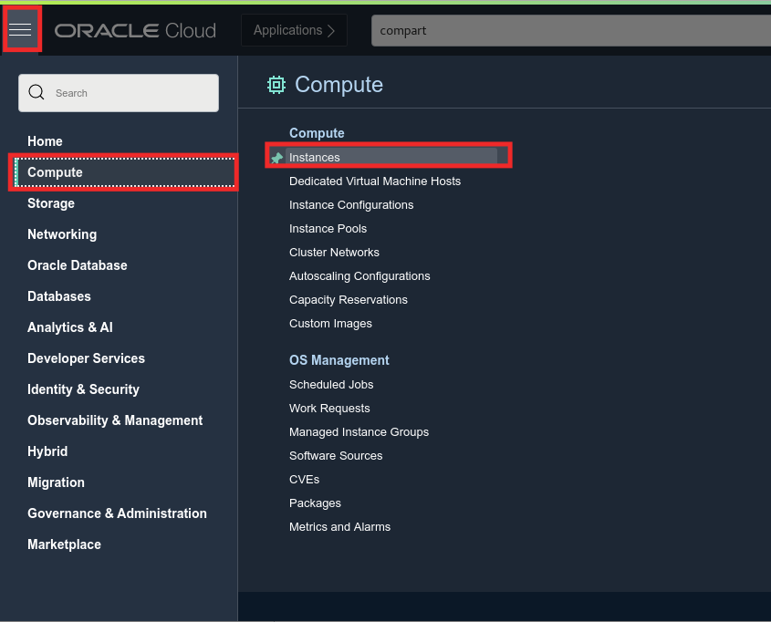
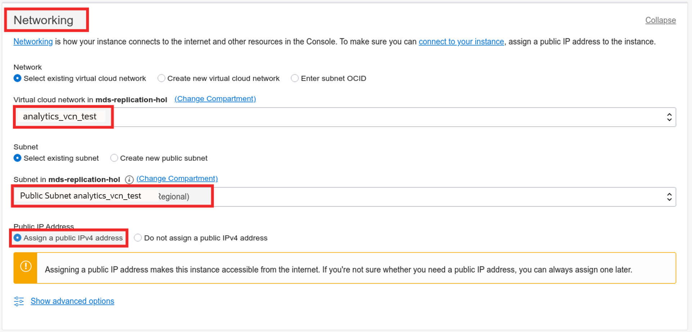
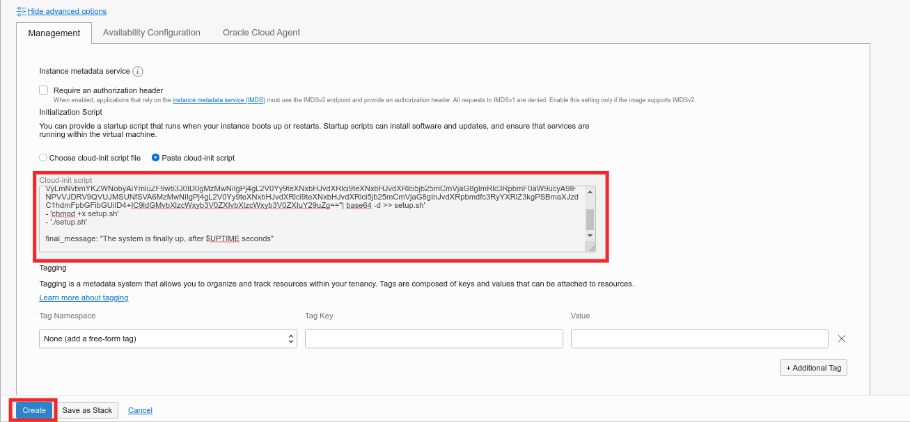
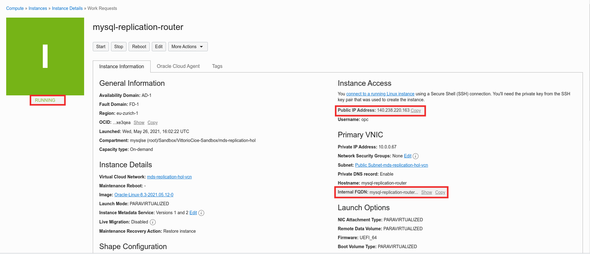

# Lab 4a: Oracle Analytics Cloud用のMySQL Routerインスタンスを作成し、MDS/HeatWaveに接続する

## 実施すること
- 特定のコンパートメントにコンピュート・インスタンスを作成する
- SSH経由でCloud Shellを利用してコンピュート・インスタンスに接続する
- Modify the MySQL Routerの接続先をMDS/HeatWaveに変更し接続する

## 概要
このでは、MySQLルーターをホストするコンピュート・インスタンスをデプロイします。MDS/HeatWaveはプライベートIPアドレスのみを公開しているため、インターネットを介してネイティブに通信することはできません。インターネットとの通信は、次の2つの方法で実現できます。

- OCIテナンシーとオンプレミス・データセンタ間のIPSecVPN接続のセットアップ：IPSecの概要**[サイト間VPN](https://docs.oracle.com/ja-jp/iaas/Content/Network/Tasks/managingIPsec.htm)**
- パブリックインターネットにアクセスできるコンピュート・インスタンス上のMySQL Routerを使用して、リバースプロキシとして機能し、OCI内部ネットワークを介して受信したトラフィックをオンプレミスのMySQLインスタンスにルーティングします。 MySQL Routerは、元々、オンプレミスの高可用性セットアップに透過的なルーティングレイヤーを提供することを目的としていますが、構成によってはひとつのインスタンスへの単純なルーティングも提供できます。 **[MySQL Routerの概要](https://www.mysql.com/jp/products/enterprise/router.html)**

IPSec接続は、オンプレミス環境をOCIに接続するために使用する **最も安全な** アプローチです。このハンズオンでは、MySQL Routerを使用してインターネット経由でデータベーストラフィックを実行します。

以下の手順では、cloud-initスクリプトを使用して、MySQLルーターを自動的にデプロイ・設定します。デプロイ後、ルーター設定でMDS/HeatWaveインスタンスのIPアドレスを設定します。

## 手順

### **Step 4.1:**
- 画面左上のメニューから _**コンピュート >> インスタンス**_ を選択します。



### **Step 4.2:**
- 正しいコンパートメントが選択されていることを確認します。

- _**インスタンスの作成**_ をクリックします。


### **Step 4.3:**
- _**名前**_ に、_**mysql-replication-router**_ (or any other name at your convenience)を入力します。

- _**配置**_ セクションではアベリラビリティ・ドメインもしくはフォルト・ドメインを変更できます。このハンズオンでは、デフォルトの設定を利用します。


### **Step 4.4:**
- _**イメージとシェイプ**_ セクションでは、OSイメージと割り当てるシェイプを設定することができます。
- このセクションが縮小されている場合は、_**編集**_ をクリックして表示します。
- 割り当てるシェイプは _**イメージの変更**_ をクリックして変更することができます。


### **Step 4.5:**
- _**すべてのイメージの参照**_ 画面で_**Oracle Linux**_ を選択し、 _**OSバージョン**_ のドロップダウンから _**8**_ を選択します。


### **Step 4.6:**
- _**イメージの選択**_ をクリックします。


### **Step 4.7:**
- _**Change Shape**_ をクリックします。


### **Step 4.8:**
- _**すべてのシェイプの参照**_ 画面で_**AMD**_ をクリックします。 Then, under _**VM.Standard.E4.Flex**_, _**OCPUの数**_ に _**2**_ を入力すると
 _**メモリー量 (GB)**_ が自動的に _**32**_　になります。その後_**シェイプの選択**_ をクリックします。


### **Step 4.9:**
- _**ネットワーキング**_ セクションに移ります。
- このセクションが縮小されている場合は、_**編集**_ をクリックして表示します。
- VCNとして _**analytics_vcn_test**_ が選択されていることを確認し、サブネットとして _**パブリック・サブネット-analytics_vcn_test (Regional)**_ が選択されていることを確認します。
- _**パブリックIPv4アドレスの割当て**_ ラジオボタンが選択されていることを確認します。



### **Step 4.10:**
- In the _**SSHキーの追加**_ セクションでは、_**キー・ペアを自動で生成**_ を選択し、_**秘密キーの保存**_ をクリックします。


- ローカルマシンに秘密キーを保存したら、ダウンロードしたパスとファイル名を控えておきます。

_**PLEASE NOTE:**_ OCIが生成する秘密キーは、名前に作成日を使用します（例：ssh-key-YYYY-MM-DD.key）。 同じ日に2つ以上の秘密鍵を生成すると、オペレーティングシステムが保存時にファイル名を変更する場合があります。 たとえば、保存している現在の秘密鍵は、次のような命名規則に従う場合がありま。
ssh-key-YYYY-MM-DD（1）.key

したがって、注意して正しいファイル名に注意してください。

### **Step 4.11:**
- Scroll down and after the _**Boot Volume**_ section, click on _**Show advanced options**_


### **Step 4.12:**
- In the _**Management**_ tab, select the _**Paste cloud-init script**_ radio button. The _**Cloud-init script**_ input box will appear as per below image.


### **Step 4.13:**
- Paste-in the following script:

```
#cloud-config
# Source: https://cloudinit.readthedocs.io/en/latest/topics/examples.html#yaml-examples
# check the yaml syntax with https://yaml-online-parser.appspot.com/

output: {all: '| tee -a /var/log/cloud-init-output.log'}

# Run these commands only at first boot
runcmd:
- 'echo "c2VkIC1pIHMvU0VMSU5VWD1lbmZvcmNpbmcvU0VMSU5VWD1wZXJtaXNzaXZlL2cgL2V0Yy9zeXNjb25maWcvc2VsaW51eApzZWQgLWkgcy9TRUxJTlVYPWVuZm9yY2luZy9TRUxJTlVYPXBlcm1pc3NpdmUvZyAvZXRjL3NlbGludXgvY29uZmlnCnN5c3RlbWN0bCBzdG9wIGZpcmV3YWxsZApzeXN0ZW1jdGwgZGlzYWJsZSBmaXJld2FsbGQKd2dldCBodHRwczovL2Rldi5teXNxbC5jb20vZ2V0L215c3FsODAtY29tbXVuaXR5LXJlbGVhc2UtZWw4LTEubm9hcmNoLnJwbQp3Z2V0IGh0dHBzOi8vZG93bmxvYWRzLm15c3FsLmNvbS9hcmNoaXZlcy9nZXQvcC80MS9maWxlL215c3FsLXJvdXRlci1jb21tdW5pdHktOC4wLjIyLTEuZWw4Lng4Nl82NC5ycG0KeXVtIGxvY2FsaW5zdGFsbCAteSAtLW5vZ3BnY2hlY2sgbXlzcWw4MC1jb21tdW5pdHktcmVsZWFzZS1lbDgtMS5ub2FyY2gucnBtCnl1bSBtb2R1bGUgLXkgLS1ub2dwZ2NoZWNrIGRpc2FibGUgbXlzcWwKeXVtIGluc3RhbGwgLXkgLS1ub2dwZ2NoZWNrIG15c3FsLXNoZWxsCnl1bSBsb2NhbGluc3RhbGwgLXkgLS1ub2dwZ2NoZWNrIG15c3FsLXJvdXRlci1jb21tdW5pdHktOC4wLjIyLTEuZWw4Lng4Nl82NC5ycG0KZWNobyAiIiA+PiAvZXRjL215c3Fscm91dGVyL215c3Fscm91dGVyLmNvbmYKZWNobyAiW3JvdXRpbmc6cHJpbWFyeV0iID4+IC9ldGMvbXlzcWxyb3V0ZXIvbXlzcWxyb3V0ZXIuY29uZgplY2hvICJiaW5kX2FkZHJlc3MgPSAwLjAuMC4wIiA+PiAvZXRjL215c3Fscm91dGVyL215c3Fscm91dGVyLmNvbmYKZWNobyAiYmluZF9wb3J0ID0gMzMwNiIgPj4gL2V0Yy9teXNxbHJvdXRlci9teXNxbHJvdXRlci5jb25mCmVjaG8gImRlc3RpbmF0aW9ucyA9IFNPVVJDRV9QVUJMSUNfSVA6MzMwNiIgPj4gL2V0Yy9teXNxbHJvdXRlci9teXNxbHJvdXRlci5jb25mCmVjaG8gInJvdXRpbmdfc3RyYXRlZ3kgPSBmaXJzdC1hdmFpbGFibGUiID4+IC9ldGMvbXlzcWxyb3V0ZXIvbXlzcWxyb3V0ZXIuY29uZgo=" | base64 -d >> setup.sh'
- 'chmod +x setup.sh'
- './setup.sh'

final_message: "The system is finally up, after $UPTIME seconds"
```

This is a cloud init script which will install MySQL Shell and MySQL Router, configuring it to require minimal effort to point it to MDS HeatWave instance.

_**MAKE SURE TO COPY AND PASTE THE SCRIPT CORRECTLY!!**_

- Once done, click _**Create**_



_**Additional extra information (NOT needed for the scopes of this lab)**_ :
As you might have realized, the cloud-init script which we are using, generates and runs a script from a base64 encoded string. This has been done in order to avoid issues which may occur when cloud-init processes special characters. For your reference, you can find the content of the script below:
```
sed -i s/SELINUX=enforcing/SELINUX=permissive/g /etc/sysconfig/selinux
sed -i s/SELINUX=enforcing/SELINUX=permissive/g /etc/selinux/config
systemctl stop firewalld
systemctl disable firewalld
wget https://dev.mysql.com/get/mysql80-community-release-el8-1.noarch.rpm
wget https://downloads.mysql.com/archives/get/p/41/file/mysql-router-community-8.0.22-1.el8.x86_64.rpm
yum localinstall -y --nogpgcheck mysql80-community-release-el8-1.noarch.rpm
yum module -y --nogpgcheck disable mysql
yum install -y --nogpgcheck mysql-shell
yum localinstall -y --nogpgcheck mysql-router-community-8.0.22-1.el8.x86_64.rpm
echo "" >> /etc/mysqlrouter/mysqlrouter.conf
echo "[routing:primary]" >> /etc/mysqlrouter/mysqlrouter.conf
echo "bind_address = 0.0.0.0" >> /etc/mysqlrouter/mysqlrouter.conf
echo "bind_port = 3306" >> /etc/mysqlrouter/mysqlrouter.conf
echo "destinations = SOURCE_PUBLIC_IP:3306" >> /etc/mysqlrouter/mysqlrouter.conf
echo "routing_strategy = first-available" >> /etc/mysqlrouter/mysqlrouter.conf
```
**PLEASE NOTE:** This is a lab environment! We are showing you how to disable firewalld and selinux JUST for simplicity!! You are not intended ever to deploy this kind of configuration on a production environment since it may lead to serious security issues!!

### **Step 4.14:**
- The instance will enter _**Provisioning**_ state.


### **Step 4.15:**
- Once provisioning is finished, the instance will enter the _**Running**_ state. It should take about a minute or so.
Once the instance is _**Running**_, take note of the _**Public IP Address**_ for ssh connection and of the _**Internal FQDN**_ for setting up the _**mysqlrouter**_ later on.



### **Step 4.16:**
- Go back to the _**Cloud Shell**_, take the previously saved private key file from your local machine, drag and drop it into the cloud shell, as shown in the picture below.


### **Step 4.17:**
_**PLEASE NOTE**_: In this step we will connect  to the MySQL Router instance. Prior to executing this step, allow it an extra couple of minutes  for the cloud-init script to complete its execution and for the instance to reboot.

- In order to connect to the MySQL Router Instance using the previously noted _**Public IP Address**_, execute the following steps:

a - Rename the recently transferred private key file and assign the privileges required by OCI
```
mv ssh-*.key router.key
chmod 600 router.key
```
b - Connect to the newly created _**MySQL Router**_ instance over ssh, replacing the  _**Public IP Address**_ after the "@":
```
ssh -i router.key opc@<router-instance-public-ip>
```
c - If prompted to accept fingerprints, enter _**yes**_


### **Step 4.18:**

- Once successfully connected to the instance where the MySQL Router is installed, we need to change the MySQL router configuration to point to the _**mysql-analytics-test**_, using the _**MDS HeatWave Private IP Address**_. In a normal scenario, you should modify the MySQL router configuration file, located under _**/etc/mysqlrouter/mysqlrouter.conf**_

- To speed things up, the MySQL Router installed on this instance has been pre-configured, and you need just to update the place holder already present in the configuration for the _**MDS HeatWave Private IP Address**_ (for example, 10.0.1.100), running the following command:
```
sudo sed -i 's/destinations =.*/destinations = 10.0.1.100:3306/g' /etc/mysqlrouter/mysqlrouter.conf
```
_**Where do I get the MDS HeatWave IP Private address?**_
Go to: _**Main Menu >> Databases >> DB Systems >>**_ Click on _**mysql-analytics-test >>**_ Check for _**Private IP**_ (as per picture below).


_**PLEASE NOTE**_: After you modify the command above inserting the _**MDS HeatWave Priate IP Address**_, your command will look as per following example:
_**sudo sed -i s/SOURCE_PUBLIC_IP/10.0.1.100/g /etc/mysqlrouter/mysqlrouter.conf**_

- Once done, check the content of the configuration file to verify that the variable _**destinations**_ is equal to the _**Private IP Address of the MDS HeatWave**_.
To do it, execute:
```
cat /etc/mysqlrouter/mysqlrouter.conf
```


### **Step 4.19:**
- It is now time to start the MySQL Router and to check the connection to the MDS HeatWave instance.
To do so execute the following steps:

a - Enable the mysqlrouter service to start on boot and start the mysqlrouter service
```
sudo systemctl enable mysqlrouter
sudo systemctl start mysqlrouter
```

b - Access the mysqlrouter and test the router to the _**mysql_analytics_test**_
```
mysqlsh --uri root:Oracle.123@127.0.0.1:3306 --sql
select @@version;
show databases;
```

### **Step 4.20:**
- Exit the MySQL Shell, executing the following command:
```
\exit
```
- _**DO NOT**_ close the ssh connection to the MySQL Router Instance.
- Reduce the Cloud Shell to icon and proceed to the following lab.


## Conclusion

In this lab you have deployed and configured MySQL Router on a Compute Instance with public internet connectivity, and pointed it to the MDS HeatWave instance. 
You can now proceed to the next and last lab.

Learn more about **[MySQL Router](https://www.mysql.com/it/products/enterprise/router.html)**
**[<< Go to Lab 4](/Lab4/README.md)** | **[Home](../README.md)** | **[Go to Lab 5 >>](/Lab5/README.md)**
