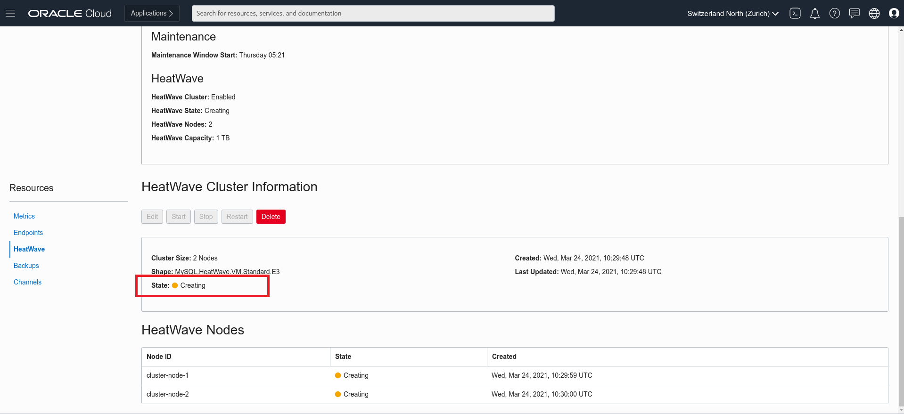

# Lab 5: Add Heatwave cluster to MySQL DB-System

## Introduction

HeatWave enables provisioning of HeatWave clusters for accelerated processing of analytic queries. A HeatWave cluster consists of a MySQL DB System node and two or more HeatWave nodes. The MySQL DB System node includes a HeatWave plugin that is responsible for cluster management, query scheduling, and returning query results to the MySQL DB System. HeatWave nodes store data in memory and process queries.

When a HeatWave cluster is enabled, queries that meet certain prerequisites are automatically offloaded from the MySQL DB System to the HeatWave cluster for accelerated execution. Queries are issued from a MySQL client or application that interacts with the HeatWave cluster by connecting to the MySQL DB System node. Results are returned to the MySQL DB System node and to the MySQL client or application that issued the query. 
After deploying a HeatWave cluster, refer to the **[HeatWave User's Guide](https://dev.mysql.com/doc/heatwave/en/)** for information about how to load data and run queries. 

## Key Objectives:
- Learn how to provision Heatwave cluster

## Steps

### **Step 5.1:**
- In the menu on the left, go to _**MySQL >> DB Systems**_
Click on the DB System which you have previously created and verify that status is _**Active**_.
Take note of the _**Private IP Address**_ of the MySQL DB System.

### **Step 5.2:**
- Scroll down and select _**HeatWave**_ from the menu on the left.
  

### **Step 5.3:**
- Click on the button _**Add HeatWave Cluster**_ located on the right.
  

### **Step 5.4:**
- Check that Shape looks as per picture below and that Node Count is set to 2.
Click the blue button _**Add HeatWave Cluster**_

### **Step 5.5:**
- You will be brought back to the main page and you can check for the creation status. After some seconds you should see the nodes in _**Creating**_ status.
  

### **Step 5.6:**
- After completion the nodes will switch to _**Active**_ status. This will take some time complete. 
  

## Conclusion

Now we have created HeatWave cluster, that consists of a MySQL DB System node and two or more HeatWave nodes.The MySQL DB System node includes a HeatWave plugin that is responsible for cluster management, query scheduling, and returning query results to the MySQL DB System. HeatWave nodes store data in memory and process queries. 
Learn more about **[HeatWave service on Oracle Cloud](https://docs.oracle.com/en-us/iaas/mysql-database/doc/heatwave1.html)** 
So let's connect to MySQL DB System and run some queries before we enable the HeatWave cluster **[in the next lab!](Lab6.md)**

