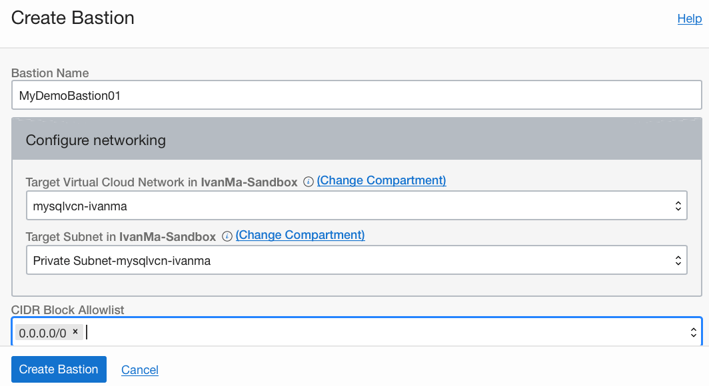
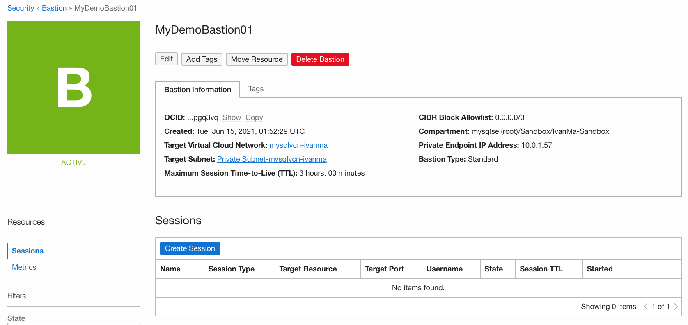
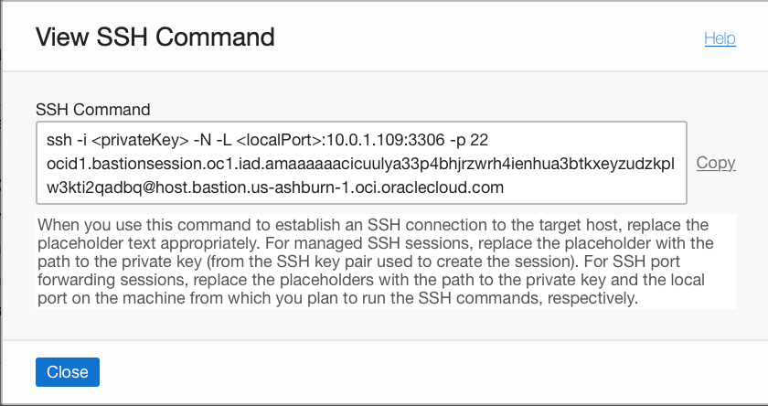

# Lab 8a: Use OCI Bastion Service to work with MDS remotely

## Key Objectives:

- Learn how to create OCI Bastion Service to manage MDS remotely

## Introduction

Oracle Cloud Infrastructure (OCI) Bastion provides restricted and time-limited access to target resources that don't have public endpoints. With OCI Bastion Service, you can
manage MDS instance via secured connection remotely using OCI Bastion Service without a Bastion compute instance to connect to MDS
For an overview of OCI Bastion Service, check **[OCI Bastion Service](https://docs.oracle.com/en-us/iaas/Content/Bastion/Concepts/bastionoverview.htm)**.

## Steps

### **Step 1.1:**
  Log-in to your OCI tenancy. Once you have logged-in, select _**Identity & Security >> Bastion Service**_ from the _**menu icon**_ on the top left corner
  


### **Step 1.2:**
 Click on _**Create Bastion**_ (make sure you have selected the right compartment on the left panel)


### **Step 1.3:** 
Fill in the details of the following fields:
 * _**Bastion Name**_: name of your Bastion service
 * _**Target Virtual Cloud Network**_: select your Virtual Cloud Network
 * _**Target Subnet**_: select the subnet where you created MDS
 * _**CIDR Block Allowlist**_: specify the IP where you will be connecting from (if unsure, you can use 0.0.0.0/0 for testing purpose)

Click on _**Create Bastion**_ to create the bastion service
  


### **Step 1.4:** 
Once the Bastion service is creted, click on  _**Create Session**_ 
 
 
 
### **Step 1.5:**
Fill in the details of the following fields:
 * _**Session Type**_: select _**SSH port forwarding session**_ from the dropdown list
 * _**Session Name**_: specify a name for the bastion session
 * _**Connect to the target host by using**_: select _**IP Address**_
 * _**IP Address**_: specify the IP address of MDS instance
 * _**Port**_: 3306 (default port number of MDS)
 * _**Add SSH Key**_: select _**generate SSH Key pair**_ and click on _**Save Private Key**_ (save the public key as well if required)
 
Click on _**Create Session**_
 


## Connect to MDS via Bastion service

### Step 1.1: 

Click on the menu on the far right of your newly created Bastion Service, select _**View SSH Command**_


## Step 1.2:

Copy the SSH command by clicking on _**Copy**_



## Step 1.3:

Click on Cloud Shell to connect to MDS via Bastion service


## Step 1.4:

Upload the downloaded Private Key to Cloud Shell and save the Private Key at your home directory in the Cloud Shell, for example, private-key.pem


## Step 1.5:

Paste the SSH Command to Cloud Shell, specify the correct location of the private key and the port number of 3306, and start connecting to MDS using mysql client

```
ssh -i ~/private-key.pem -N -L 3306:10.0.0.1:3306 -p 22 ocid.blah.blah &
mysql -uadmin -h127.0.0.1 -P3306 -pPassword
```


## Conclusion

In this bonus lab, you have learnt how to create a Bastion Service to connect to your MDS instance without the need of a Bastion compute 

**[Home](../README.md)** | 
