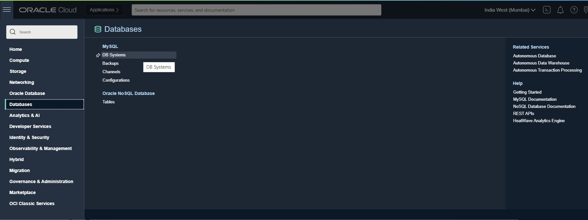
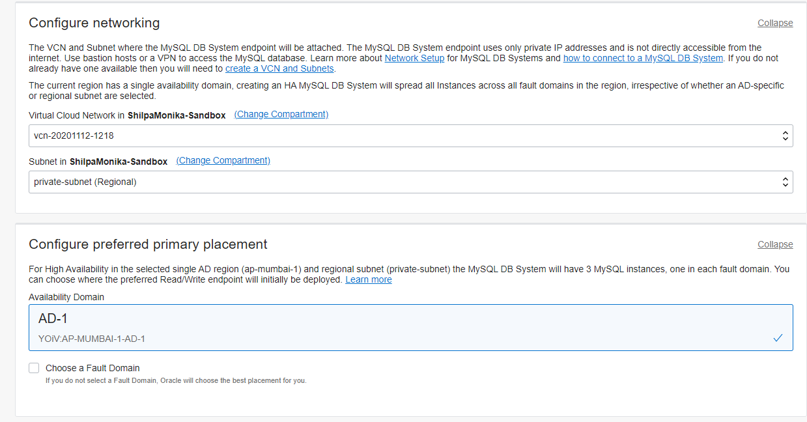
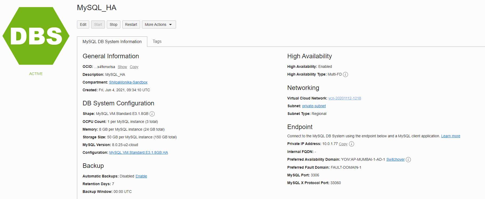

# Lab 8b: MDS高可用性構成を利用してミッションクリティカルアプリケーションを運用する

## 学べること

- MDS高可用性構成を作成・セットアップする方法を学ぶ

## 概要

MDSは、データ損失をゼロにすることを要求するミッションクリティカルなアプリケーションに _**高可用性**_ を提供します。MDS 高可用性構成には、異なるアベイラビリティ。ドメインまたはフォルト・ドメインにデプロイされた3つのMySQLインスタンスが含まれています。 データは、MySQLグループレプリケーションを使用してレプリケートされます。 アプリケーションは単一のエンドポイントに接続して、データベースのデータ読み取りと書き込みを行います。 障害が発生した場合、DBシステムは、アプリケーションの再構成を必要とせずに、セカンダリインスタンスに自動的にフェイルオーバーします。
MDS高可用性構成の概要については、**[高可用性](https://docs.oracle.com/ja-jp/iaas/mysql-database/doc/business-continuity.html#MYAAS-GUID-2CD8BFB9-30B2-4ED5-BE27-E526DD3F6E0A)** をご参照ください。

## 手順

### **Step 1.1:**
  OCIコンソール左上のメニューから _**データベース >> MySQL >> DBシステム**_ を選択します。
  

### **Step 1.2:**
 _**MySQL DBシステムの作成**_ をクリックします。

### **Step 1.3:** 
 _**高可用性**_ を選択し、各項目を入力します。
 * _**コンパートメントに作成**_: 適切なコンパートメント
 * _**名前**_: MDSインスタンの名前 (例: MDS_HA)
 * _**説明**_: MDSインスタンス利用用途などの説明
 * _**ユーザー名**_: MDSの管理者(例： admin)
 * _**パスワード**_: 管理者パスワード

### **Step 1.3:** 
 _**仮想クラウド・ネットワーク**_ を選択します。(デフォルトでは、仮想クラウド・ネットワークのプライベート・サブネットが設定されています)
 
 

### **Step 1.4:**
 _**作成**_ をクリックするとMDS高可用性構成が数分後に利用できるようになります。 Enjoy!
 
 
 
## まとめ

ボーナストラックの演習が完了しました！Congratulations!

**[<< Lab 8a](/Lab8a/README.md)** | **[Home](../README.md)** 

